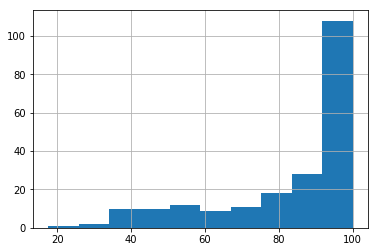
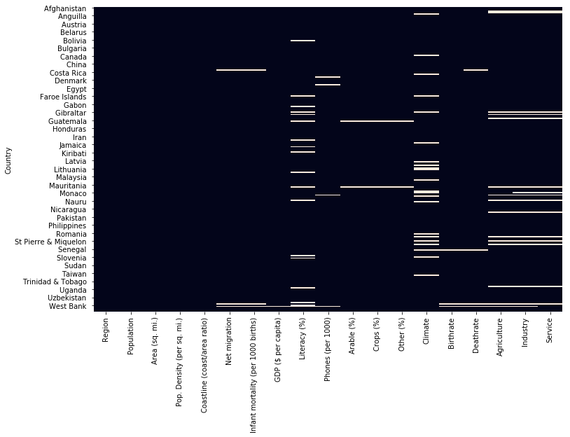

---
layout: post
author: Axel-Cleris Gailloty
category: R

---


# Analyse en composante principale


Je suis content de vous présenter ce petit tutoriel qui porte sur l'`Analyse en composante principale`, un de mes outils préférés pour explorer les données. J'ai toujours fait mes `ACP`avec R mais récemment en m'inscrivant dans le cours `Réaliser une analyse exploratoire des données`sur OpenClassroom j'ai trouvé de bons moyens de le réaliser facilement avec Python, scikit-learn. Je vous livre donc ici cette technique.


```python
# Importons les libraries
from sklearn import preprocessing, decomposition
```


```python
# Pour les représentations graphiques, nous allons utiliser cette fonction
import matplotlib.pyplot as plt
from matplotlib.collections import LineCollection
import numpy as np
import pandas as pd
from scipy.cluster.hierarchy import dendrogram

def display_circles(pcs, n_comp, pca, axis_ranks, labels=None, label_rotation=0, lims=None):
    for d1, d2 in axis_ranks: # On affiche les 3 premiers plans factoriels, donc les 6 premières composantes
        if d2 < n_comp:

            # initialisation de la figure
            fig, ax = plt.subplots(figsize=(7,6))

            # détermination des limites du graphique
            if lims is not None :
                xmin, xmax, ymin, ymax = lims
            elif pcs.shape[1] < 30 :
                xmin, xmax, ymin, ymax = -1, 1, -1, 1
            else :
                xmin, xmax, ymin, ymax = min(pcs[d1,:]), max(pcs[d1,:]), min(pcs[d2,:]), max(pcs[d2,:])

            # affichage des flèches
            # s'il y a plus de 30 flèches, on n'affiche pas le triangle à leur extrémité
            if pcs.shape[1] < 30 :
                plt.quiver(np.zeros(pcs.shape[1]), np.zeros(pcs.shape[1]),
                   pcs[d1,:], pcs[d2,:], 
                   angles='xy', scale_units='xy', scale=1, color="grey")
                # (voir la doc : https://matplotlib.org/api/_as_gen/matplotlib.pyplot.quiver.html)
            else:
                lines = [[[0,0],[x,y]] for x,y in pcs[[d1,d2]].T]
                ax.add_collection(LineCollection(lines, axes=ax, alpha=.1, color='black'))
            
            # affichage des noms des variables  
            if labels is not None:  
                for i,(x, y) in enumerate(pcs[[d1,d2]].T):
                    if x >= xmin and x <= xmax and y >= ymin and y <= ymax :
                        plt.text(x, y, labels[i], fontsize='14', ha='center', va='center', rotation=label_rotation, color="blue", alpha=0.5)
            
            # affichage du cercle
            circle = plt.Circle((0,0), 1, facecolor='none', edgecolor='b')
            plt.gca().add_artist(circle)

            # définition des limites du graphique
            plt.xlim(xmin, xmax)
            plt.ylim(ymin, ymax)
        
            # affichage des lignes horizontales et verticales
            plt.plot([-1, 1], [0, 0], color='grey', ls='--')
            plt.plot([0, 0], [-1, 1], color='grey', ls='--')

            # nom des axes, avec le pourcentage d'inertie expliqué
            plt.xlabel('F{} ({}%)'.format(d1+1, round(100*pca.explained_variance_ratio_[d1],1)))
            plt.ylabel('F{} ({}%)'.format(d2+1, round(100*pca.explained_variance_ratio_[d2],1)))

            plt.title("Cercle des corrélations (F{} et F{})".format(d1+1, d2+1))
            plt.show(block=False)
        
def display_factorial_planes(X_projected, n_comp, pca, axis_ranks, labels=None, alpha=1, illustrative_var=None):
    for d1,d2 in axis_ranks:
        if d2 < n_comp:
 
            # initialisation de la figure       
            fig = plt.figure(figsize=(7,6))
        
            # affichage des points
            if illustrative_var is None:
                plt.scatter(X_projected[:, d1], X_projected[:, d2], alpha=alpha)
            else:
                illustrative_var = np.array(illustrative_var)
                for value in np.unique(illustrative_var):
                    selected = np.where(illustrative_var == value)
                    plt.scatter(X_projected[selected, d1], X_projected[selected, d2], alpha=alpha, label=value)
                plt.legend()

            # affichage des labels des points
            if labels is not None:
                for i,(x,y) in enumerate(X_projected[:,[d1,d2]]):
                    plt.text(x, y, labels[i],
                              fontsize='14', ha='center',va='center') 
                
            # détermination des limites du graphique
            boundary = np.max(np.abs(X_projected[:, [d1,d2]])) * 1.1
            plt.xlim([-boundary,boundary])
            plt.ylim([-boundary,boundary])
        
            # affichage des lignes horizontales et verticales
            plt.plot([-100, 100], [0, 0], color='grey', ls='--')
            plt.plot([0, 0], [-100, 100], color='grey', ls='--')

            # nom des axes, avec le pourcentage d'inertie expliqué
            plt.xlabel('F{} ({}%)'.format(d1+1, round(100*pca.explained_variance_ratio_[d1],1)))
            plt.ylabel('F{} ({}%)'.format(d2+1, round(100*pca.explained_variance_ratio_[d2],1)))

            plt.title("Projection des individus (sur F{} et F{})".format(d1+1, d2+1))
            plt.show(block=False)

def display_scree_plot(pca):
    scree = pca.explained_variance_ratio_*100
    plt.bar(np.arange(len(scree))+1, scree)
    plt.plot(np.arange(len(scree))+1, scree.cumsum(),c="red",marker='o')
    plt.xlabel("rang de l'axe d'inertie")
    plt.ylabel("pourcentage d'inertie")
    plt.title("Eboulis des valeurs propres")
    plt.show(block=False)

def plot_dendrogram(Z, names):
    plt.figure(figsize=(10,25))
    plt.title('Hierarchical Clustering Dendrogram')
    plt.xlabel('distance')
    dendrogram(
        Z,
        labels = names,
        orientation = "left",
    )
    plt.show()

```


```python
pays = pd.read_csv('pays.csv',decimal=b',' )
pays.head(4)
```


<div>
<style scoped>
    .dataframe tbody tr th:only-of-type {
        vertical-align: middle;
    }

    .dataframe tbody tr th {
        vertical-align: top;
    }

    .dataframe thead th {
        text-align: right;
    }
</style>
<table border="1" class="dataframe">
  <thead>
    <tr style="text-align: right;">
      <th></th>
      <th>Country</th>
      <th>Region</th>
      <th>Population</th>
      <th>Area (sq. mi.)</th>
      <th>Pop. Density (per sq. mi.)</th>
      <th>Coastline (coast/area ratio)</th>
      <th>Net migration</th>
      <th>Infant mortality (per 1000 births)</th>
      <th>GDP ($ per capita)</th>
      <th>Literacy (%)</th>
      <th>Phones (per 1000)</th>
      <th>Arable (%)</th>
      <th>Crops (%)</th>
      <th>Other (%)</th>
      <th>Climate</th>
      <th>Birthrate</th>
      <th>Deathrate</th>
      <th>Agriculture</th>
      <th>Industry</th>
      <th>Service</th>
    </tr>
  </thead>
  <tbody>
    <tr>
      <th>0</th>
      <td>Afghanistan</td>
      <td>ASIA (EX. NEAR EAST)</td>
      <td>31056997</td>
      <td>647500</td>
      <td>48.0</td>
      <td>0.00</td>
      <td>23.06</td>
      <td>163.07</td>
      <td>700.0</td>
      <td>36.0</td>
      <td>3.2</td>
      <td>12.13</td>
      <td>0.22</td>
      <td>87.65</td>
      <td>1.0</td>
      <td>46.60</td>
      <td>20.34</td>
      <td>0.380</td>
      <td>0.240</td>
      <td>0.380</td>
    </tr>
    <tr>
      <th>1</th>
      <td>Albania</td>
      <td>EASTERN EUROPE</td>
      <td>3581655</td>
      <td>28748</td>
      <td>124.6</td>
      <td>1.26</td>
      <td>-4.93</td>
      <td>21.52</td>
      <td>4500.0</td>
      <td>86.5</td>
      <td>71.2</td>
      <td>21.09</td>
      <td>4.42</td>
      <td>74.49</td>
      <td>3.0</td>
      <td>15.11</td>
      <td>5.22</td>
      <td>0.232</td>
      <td>0.188</td>
      <td>0.579</td>
    </tr>
    <tr>
      <th>2</th>
      <td>Algeria</td>
      <td>NORTHERN AFRICA</td>
      <td>32930091</td>
      <td>2381740</td>
      <td>13.8</td>
      <td>0.04</td>
      <td>-0.39</td>
      <td>31.00</td>
      <td>6000.0</td>
      <td>70.0</td>
      <td>78.1</td>
      <td>3.22</td>
      <td>0.25</td>
      <td>96.53</td>
      <td>1.0</td>
      <td>17.14</td>
      <td>4.61</td>
      <td>0.101</td>
      <td>0.600</td>
      <td>0.298</td>
    </tr>
    <tr>
      <th>3</th>
      <td>American Samoa</td>
      <td>OCEANIA</td>
      <td>57794</td>
      <td>199</td>
      <td>290.4</td>
      <td>58.29</td>
      <td>-20.71</td>
      <td>9.27</td>
      <td>8000.0</td>
      <td>97.0</td>
      <td>259.5</td>
      <td>10.00</td>
      <td>15.00</td>
      <td>75.00</td>
      <td>2.0</td>
      <td>22.46</td>
      <td>3.27</td>
      <td>NaN</td>
      <td>NaN</td>
      <td>NaN</td>
    </tr>
  </tbody>
</table>
</div>


Nous avons une base de donée regroupant les pays du monde avec différents indicateurs économiques


```python
# Choisissons comme index les pays
pays.set_index("Country", inplace=True)
```

# Analyse exploratoire des données

Nous allons explorer la base de données pour comprendre ce dont elle parle. On réalisera les statistiques descriptives et quelques visualisations

## Statistiques descriptives


```python
pays.describe()
```


<div>
<style scoped>
    .dataframe tbody tr th:only-of-type {
        vertical-align: middle;
    }

    .dataframe tbody tr th {
        vertical-align: top;
    }

    .dataframe thead th {
        text-align: right;
    }
</style>
<table border="1" class="dataframe">
  <thead>
    <tr style="text-align: right;">
      <th></th>
      <th>Population</th>
      <th>Area (sq. mi.)</th>
      <th>Pop. Density (per sq. mi.)</th>
      <th>Coastline (coast/area ratio)</th>
      <th>Net migration</th>
      <th>Infant mortality (per 1000 births)</th>
      <th>GDP ($ per capita)</th>
      <th>Literacy (%)</th>
      <th>Phones (per 1000)</th>
      <th>Arable (%)</th>
      <th>Crops (%)</th>
      <th>Other (%)</th>
      <th>Climate</th>
      <th>Birthrate</th>
      <th>Deathrate</th>
      <th>Agriculture</th>
      <th>Industry</th>
      <th>Service</th>
    </tr>
  </thead>
  <tbody>
    <tr>
      <th>count</th>
      <td>2.270000e+02</td>
      <td>2.270000e+02</td>
      <td>227.000000</td>
      <td>227.000000</td>
      <td>224.000000</td>
      <td>224.000000</td>
      <td>226.000000</td>
      <td>209.000000</td>
      <td>223.000000</td>
      <td>225.000000</td>
      <td>225.000000</td>
      <td>225.000000</td>
      <td>205.000000</td>
      <td>224.000000</td>
      <td>223.000000</td>
      <td>212.000000</td>
      <td>211.000000</td>
      <td>212.000000</td>
    </tr>
    <tr>
      <th>mean</th>
      <td>2.874028e+07</td>
      <td>5.982270e+05</td>
      <td>379.047137</td>
      <td>21.165330</td>
      <td>0.038125</td>
      <td>35.506964</td>
      <td>9689.823009</td>
      <td>82.838278</td>
      <td>236.061435</td>
      <td>13.797111</td>
      <td>4.564222</td>
      <td>81.638311</td>
      <td>2.139024</td>
      <td>22.114732</td>
      <td>9.241345</td>
      <td>0.150844</td>
      <td>0.282711</td>
      <td>0.565283</td>
    </tr>
    <tr>
      <th>std</th>
      <td>1.178913e+08</td>
      <td>1.790282e+06</td>
      <td>1660.185825</td>
      <td>72.286863</td>
      <td>4.889269</td>
      <td>35.389899</td>
      <td>10049.138513</td>
      <td>19.722173</td>
      <td>227.991829</td>
      <td>13.040402</td>
      <td>8.361470</td>
      <td>16.140835</td>
      <td>0.699397</td>
      <td>11.176716</td>
      <td>4.990026</td>
      <td>0.146798</td>
      <td>0.138272</td>
      <td>0.165841</td>
    </tr>
    <tr>
      <th>min</th>
      <td>7.026000e+03</td>
      <td>2.000000e+00</td>
      <td>0.000000</td>
      <td>0.000000</td>
      <td>-20.990000</td>
      <td>2.290000</td>
      <td>500.000000</td>
      <td>17.600000</td>
      <td>0.200000</td>
      <td>0.000000</td>
      <td>0.000000</td>
      <td>33.330000</td>
      <td>1.000000</td>
      <td>7.290000</td>
      <td>2.290000</td>
      <td>0.000000</td>
      <td>0.020000</td>
      <td>0.062000</td>
    </tr>
    <tr>
      <th>25%</th>
      <td>4.376240e+05</td>
      <td>4.647500e+03</td>
      <td>29.150000</td>
      <td>0.100000</td>
      <td>-0.927500</td>
      <td>8.150000</td>
      <td>1900.000000</td>
      <td>70.600000</td>
      <td>37.800000</td>
      <td>3.220000</td>
      <td>0.190000</td>
      <td>71.650000</td>
      <td>2.000000</td>
      <td>12.672500</td>
      <td>5.910000</td>
      <td>0.037750</td>
      <td>0.193000</td>
      <td>0.429250</td>
    </tr>
    <tr>
      <th>50%</th>
      <td>4.786994e+06</td>
      <td>8.660000e+04</td>
      <td>78.800000</td>
      <td>0.730000</td>
      <td>0.000000</td>
      <td>21.000000</td>
      <td>5550.000000</td>
      <td>92.500000</td>
      <td>176.200000</td>
      <td>10.420000</td>
      <td>1.030000</td>
      <td>85.700000</td>
      <td>2.000000</td>
      <td>18.790000</td>
      <td>7.840000</td>
      <td>0.099000</td>
      <td>0.272000</td>
      <td>0.571000</td>
    </tr>
    <tr>
      <th>75%</th>
      <td>1.749777e+07</td>
      <td>4.418110e+05</td>
      <td>190.150000</td>
      <td>10.345000</td>
      <td>0.997500</td>
      <td>55.705000</td>
      <td>15700.000000</td>
      <td>98.000000</td>
      <td>389.650000</td>
      <td>20.000000</td>
      <td>4.440000</td>
      <td>95.440000</td>
      <td>3.000000</td>
      <td>29.820000</td>
      <td>10.605000</td>
      <td>0.221000</td>
      <td>0.341000</td>
      <td>0.678500</td>
    </tr>
    <tr>
      <th>max</th>
      <td>1.313974e+09</td>
      <td>1.707520e+07</td>
      <td>16271.500000</td>
      <td>870.660000</td>
      <td>23.060000</td>
      <td>191.190000</td>
      <td>55100.000000</td>
      <td>100.000000</td>
      <td>1035.600000</td>
      <td>62.110000</td>
      <td>50.680000</td>
      <td>100.000000</td>
      <td>4.000000</td>
      <td>50.730000</td>
      <td>29.740000</td>
      <td>0.769000</td>
      <td>0.906000</td>
      <td>0.954000</td>
    </tr>
  </tbody>
</table>
</div>


```python
pays["Population"].hist(bins = 50)
```


    <matplotlib.axes._subplots.AxesSubplot at 0x1e8729beda0>


```python
pays["Literacy (%)"].hist()
```


    <matplotlib.axes._subplots.AxesSubplot at 0x1e870de4a90>





## Valeurs manquantes


```python
import seaborn as sns
import matplotlib.pyplot as plt
```


```python
plt.figure(figsize = (12,8))
sns.heatmap(pays.isna(), cbar = False)
```


    <matplotlib.axes._subplots.AxesSubplot at 0x1e8717a38d0>





La base de donnée demble bien avoir des valeurs manquantes, essayons de voir dans quelles proportions et proposons une solution pour imputer les valeurs manquantes.


```python
pays["Region"] = pays["Region"].apply(lambda region: region.strip())
```


```python
for i, region in enumerate(pays.columns):
    pays[region].interpolate(inplace = True)
```


```python
plt.figure(figsize = (12,8))
sns.heatmap(pays.isna(), cbar = False)
```


    <matplotlib.axes._subplots.AxesSubplot at 0x1e870f443c8>


Nous avons réussi à remplir toutes les valeurs manquantes. La méthode interpolate utilise un algorithme qui impute automatiquement les valeurs manquantes selon leur ressemblance

# Analyse en composante principale (ACP)

Nous allons pour l'ACP sélectionner les colonnes numériques dont nous avons besoin.


```python
data_acp = pays.select_dtypes(include = np.number)
```


```python
# Mettons à l'échelle ces données
data_scaled = pd.DataFrame(preprocessing.scale(data_acp), columns = data_acp.columns, index = data_acp.index)
data_scaled.head()
```

    C:\Users\Axel-Cleris Gailloty\Anaconda3\lib\site-packages\ipykernel_launcher.py:2: DataConversionWarning: Data with input dtype int64, float64 were all converted to float64 by the scale function.
      
    


<div>
<style scoped>
    .dataframe tbody tr th:only-of-type {
        vertical-align: middle;
    }

    .dataframe tbody tr th {
        vertical-align: top;
    }

    .dataframe thead th {
        text-align: right;
    }
</style>
<table border="1" class="dataframe">
  <thead>
    <tr style="text-align: right;">
      <th></th>
      <th>Population</th>
      <th>Area (sq. mi.)</th>
      <th>Pop. Density (per sq. mi.)</th>
      <th>Coastline (coast/area ratio)</th>
      <th>Net migration</th>
      <th>Infant mortality (per 1000 births)</th>
      <th>GDP ($ per capita)</th>
      <th>Literacy (%)</th>
      <th>Phones (per 1000)</th>
      <th>Arable (%)</th>
      <th>Crops (%)</th>
      <th>Other (%)</th>
      <th>Climate</th>
      <th>Birthrate</th>
      <th>Deathrate</th>
      <th>Agriculture</th>
      <th>Industry</th>
      <th>Service</th>
    </tr>
    <tr>
      <th>Country</th>
      <th></th>
      <th></th>
      <th></th>
      <th></th>
      <th></th>
      <th></th>
      <th></th>
      <th></th>
      <th></th>
      <th></th>
      <th></th>
      <th></th>
      <th></th>
      <th></th>
      <th></th>
      <th></th>
      <th></th>
      <th></th>
    </tr>
  </thead>
  <tbody>
    <tr>
      <th>Afghanistan</th>
      <td>0.019695</td>
      <td>0.027583</td>
      <td>-0.199844</td>
      <td>-0.293443</td>
      <td>4.747005</td>
      <td>3.631749</td>
      <td>-0.893094</td>
      <td>-2.387164</td>
      <td>-1.019838</td>
      <td>-0.132071</td>
      <td>-0.521222</td>
      <td>0.376404</td>
      <td>-1.698188</td>
      <td>2.193874</td>
      <td>2.251525</td>
      <td>1.613398</td>
      <td>-0.328904</td>
      <td>-1.118032</td>
    </tr>
    <tr>
      <th>Albania</th>
      <td>-0.213877</td>
      <td>-0.318797</td>
      <td>-0.153603</td>
      <td>-0.275974</td>
      <td>-1.022821</td>
      <td>-0.398180</td>
      <td>-0.513931</td>
      <td>0.209690</td>
      <td>-0.719186</td>
      <td>0.556613</td>
      <td>-0.015669</td>
      <td>-0.442514</td>
      <td>1.236074</td>
      <td>-0.636869</td>
      <td>-0.804653</td>
      <td>0.574903</td>
      <td>-0.705377</td>
      <td>0.095152</td>
    </tr>
    <tr>
      <th>Algeria</th>
      <td>0.035618</td>
      <td>0.998421</td>
      <td>-0.220490</td>
      <td>-0.292889</td>
      <td>-0.086951</td>
      <td>-0.128284</td>
      <td>-0.364262</td>
      <td>-0.638787</td>
      <td>-0.688679</td>
      <td>-0.816911</td>
      <td>-0.517611</td>
      <td>0.928987</td>
      <td>-1.698188</td>
      <td>-0.454385</td>
      <td>-0.927951</td>
      <td>-0.344305</td>
      <td>2.277449</td>
      <td>-1.617937</td>
    </tr>
    <tr>
      <th>American Samoa</th>
      <td>-0.243834</td>
      <td>-0.334779</td>
      <td>-0.053514</td>
      <td>0.514709</td>
      <td>-4.275691</td>
      <td>-0.746938</td>
      <td>-0.164702</td>
      <td>0.749629</td>
      <td>0.113355</td>
      <td>-0.295787</td>
      <td>1.257842</td>
      <td>-0.410778</td>
      <td>-0.231057</td>
      <td>0.023847</td>
      <td>-1.198803</td>
      <td>-0.356000</td>
      <td>2.417420</td>
      <td>-1.723608</td>
    </tr>
    <tr>
      <th>Andorra</th>
      <td>-0.243720</td>
      <td>-0.334629</td>
      <td>-0.137002</td>
      <td>-0.293443</td>
      <td>1.353960</td>
      <td>-0.895551</td>
      <td>0.932874</td>
      <td>0.903898</td>
      <td>1.164311</td>
      <td>-0.893773</td>
      <td>-0.547703</td>
      <td>1.006772</td>
      <td>1.236074</td>
      <td>-1.212187</td>
      <td>-0.596461</td>
      <td>-0.367695</td>
      <td>2.557391</td>
      <td>-1.829278</td>
    </tr>
  </tbody>
</table>
</div>


```python
ACP = decomposition.PCA(n_components= 4)
```


```python
ACP.fit(data_scaled)
```


    PCA(copy=True, iterated_power='auto', n_components=4, random_state=None,
      svd_solver='auto', tol=0.0, whiten=False)


Notre ACP a été réalisé. Maintenant on peut interpréter graphiquement les résultats


```python
def display_scree_plot(pca):
    scree = pca.explained_variance_ratio_*100
    plt.bar(np.arange(len(scree))+1, scree)
    plt.plot(np.arange(len(scree))+1, scree.cumsum(),c="red",marker='o')
    plt.xlabel("rang de l'axe d'inertie")
    plt.ylabel("pourcentage d'inertie")
    plt.title("Eboulis des valeurs propres")
    plt.show(block=False)
```


```python
plt.figure(figsize = (8,5))
display_scree_plot(ACP)
```


Nous voyons que globalement la première dimension ou variable synthétique explique environ 30% de l'information. La deuxième dimension quant à elle explique environ 15%. Ces deux dimensions combinées nous permettent d'expliquer sensiblement 45% de la variabilité entre les pays. 


```python
composantes = ACP.components_
nbre_composantes = ACP.n_components
```


```python
display_circles(composantes, nbre_composantes, ACP, axis_ranks= [(0,1),(1,2)], labels= np.array(data_acp.columns))
```<figure> 
</figure>


```python
# Projection des individus
X_projected = ACP.transform(data_scaled)
display_factorial_planes(X_projected, nbre_composantes, ACP, [(0,1),(2,3)])
```
<figure></figure>


